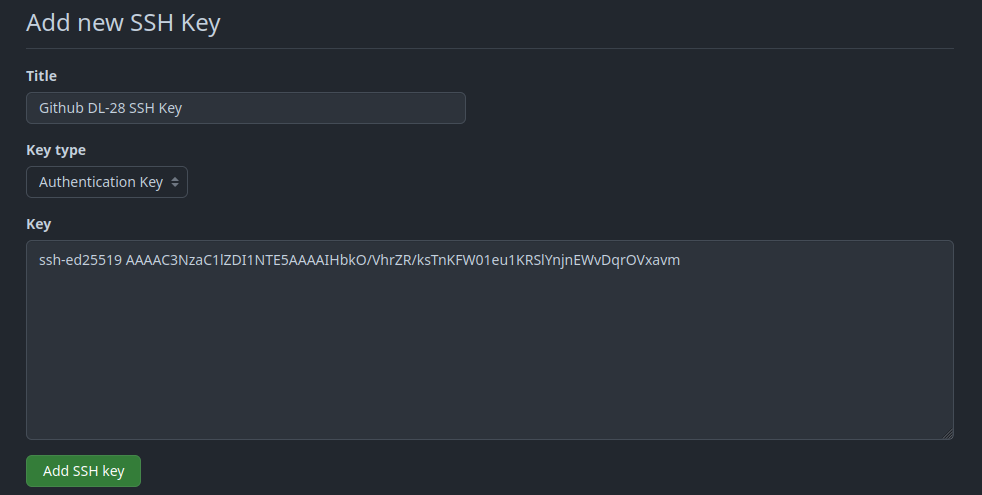
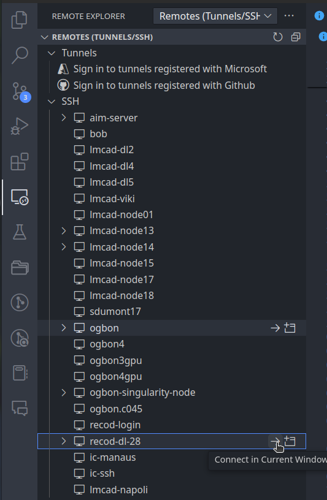
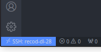
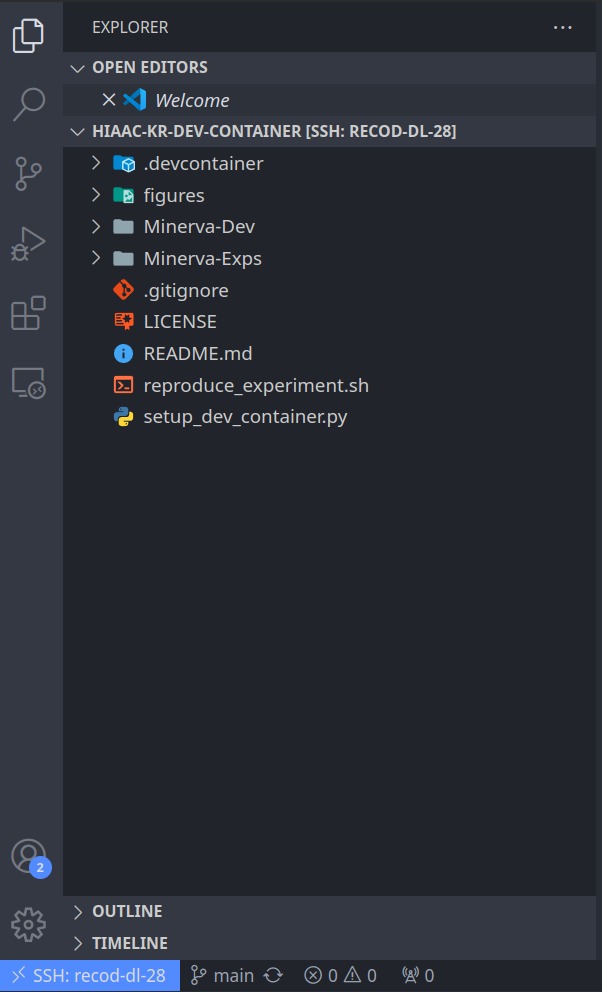
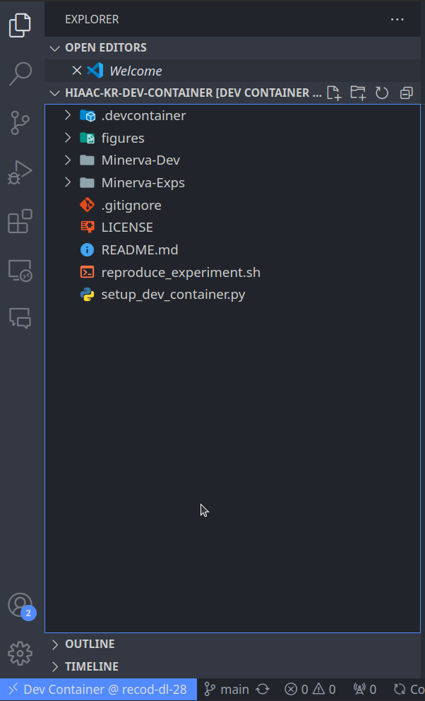

# Benchmarking_Enconders_SSL
Code regarding reproduction of the paper "Benchmarking Encoders and Self-Supervised Learning for Smartphone-Based Human Activity Recognition", submitted to IEEE Access

# HIAAC-KR-DEV-CONTAINER

This repository contains a general vscode development workspace setup for developing using `Minerva-Dev` and `Minerva-Exps`.  
It will create a workspace with the following folders:
```
.
├── Minerva-Dev/
├── Minerva-Exps/
├── shared_data/
└── shared_runs/
```

The [`Minerva-Dev`](https://github.com/discovery-unicamp/Minerva-Dev) and [`Minerva-Exps`](https://github.com/discovery-unicamp/Minerva-Exps) folders will be cloned from their respective repositories.
The `shared_data` and `shared_runs` folders are shared between the host and the container. 
This is usually a directory in the host machine that is mounted in the container that is shared with the team.

## Prerequisites

1. Install [Docker](https://docs.docker.com/get-docker/) in the remote machine.

2. Install [Visual Studio Code](https://code.visualstudio.com/) in the local machine.

3. Install the [Remote Development Extension Pack](https://marketplace.visualstudio.com/items?itemName=ms-vscode-remote.vscode-remote-extensionpack) in the local machine.


## How to Setup the Development Environment

We use the following terms:
- `local machine`: your personal machine (also called `host machine`) that will be used to connect to the server.
- `remote machine`: the machine where the container will be running (server).
- `remote container`: the container running in the `remote machine`.


### Setting up the SSH Key fog Github and Agent Forwarding

> **Note**: The following steps must be done in the remote machine. **We just need to do it once**.

As we will use private repositories, we need to setup the SSH key to access the repositories. Thus, we will generate a SSH key pair and add the public key to the github account. Then, we will configure the SSH key in remote machine to use passwordless SSH access to github.
To do this, follow the steps below:


1. In the remote machine, generate a SSH key pair using the command below (**PLEASE ADD A PASSWORD TO YOUR SSH KEY**) and follow the instructions on the screen. At the end of the process, you will have two files: `~/.ssh/id_ed25519_github` (private key) and `~/.ssh/id_ed25519_github.pub` (public key).

```bash
ssh-keygen -t ed25519 -C "github key" -f ~/.ssh/id_ed25519_github
```

2. Copy the content of the public key to your github account. First, run the following command:

```bash
cat ~/.ssh/id_ed25519_github.pub
```

And copy the content (output of command above) to your github account, at [`https://github.com/settings/keys`](https://github.com/settings/keys) and select `New SSH key`. 
This is shown in the image below. The Title can be anything you want. The Key Type must be "Authentication Key".



3. Add the SSH key to the SSH agent. To do this, run the command below. It will be asked for password of the SSH key.:

```bash
eval "$(ssh-agent -s)"
ssh-add ~/.ssh/id_ed25519_github
```

4. Test the SSH key by running the command below. If everything is ok, you will see a message like `Hi <username>! You've successfully authenticated, but GitHub does not provide shell access.`.

```bash
ssh -T git@github.com
```


### Setting up Repositories

1. In the remote machine, clone this repository using the command below:

```bash
git clone git@github.com:discovery-unicamp/HIAAC-KR-Dev-Container.git ~/HIAAC-KR-Dev-Container
```

2. Clone the `Minerva-Dev` and `Minerva-Exps` inside `HIAAC-KR-Dev-Container` directory. To do this, run the following commands:

```bash
git clone git@github.com:discovery-unicamp/Minerva-Dev.git ~/HIAAC-KR-Dev-Container/Minerva-Dev
git clone git@github.com:discovery-unicamp/Minerva-Exps.git ~/HIAAC-KR-Dev-Container/Minerva-Exps
```
3. After that, let's configure the container. To do this, run the following command:

```bash
cd ~/HIAAC-KR-Dev-Container
python3 ./setup_dev_container.py
```

This is an interactive script that will ask you some questions to configure the workspace. The script will ask you to set the name of the container, the mount points, etc.

4. Now, you can build the container. In the local machine (your personal machine), open Visual Studio Code and connect to the remote machine using the Remote Development Extension Pack. This is illustrated in the image below.



Once connected, in the bottom left corner of the window, you will see the name of remote machine you are connected to, like in the image below.



5. Now, we need to open our workspace. To do this, click on the `File` menu, then `Open Folder...` and select the `HIAAC-KR-Dev-Container` folder (`~/HIAAC-KR-Dev-Container`). Onde opened, you will see the workspace folders, like in the image below.




6. Now, we need to build the development container. To do this, open the command palette (Ctrl+Shift+P) and type `Remote-Containers: Reopen in Container`. This will build the container and open the workspace inside the container.

7. Once connected to the container, you will see the workspace folders, and in the bottom left corner of the window, you will see the name of the container you are connected to, like in the image below.



8. Inside remote container, check your SSH to github. First, open a terminal, by clicking on the `Terminal` menu, then `New Terminal`. Then, run the command below:

```bash
ssh -T git@github.com
```

If everything is ok, you will see a message like `Hi <username> You've successfully authenticated, but GitHub does not provide shell access.`.

9. Now, you can start developing! Enjoy!


## Notes

For a detailed explanation and troubleshooting, [check this repository](https://github.com/otavioon/container-workspace).

## License

This repository is licensed under the MIT License - see the [LICENSE](LICENSE) file for details.

